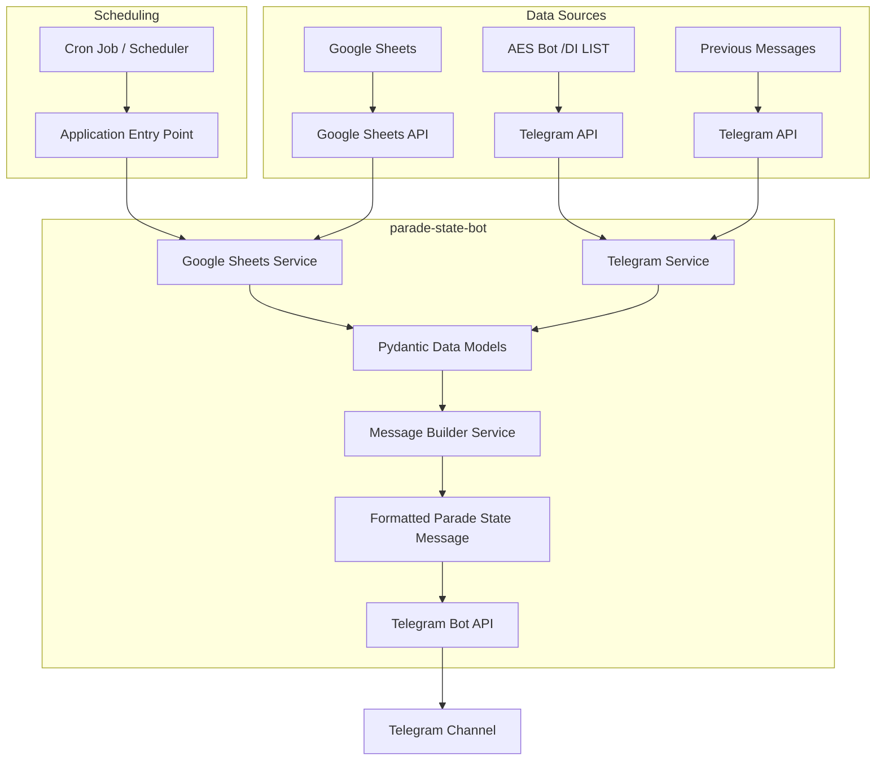

# Parade State Bot Technical Plan

## Directory Structure

```
parade-state-bot/
├── app/
│   ├── __init__.py
│   ├── main.py                 # Application entry point
│   ├── config.py               # Configuration handling
│   ├── models/                 # Pydantic models
│   │   ├── __init__.py
│   │   ├── staff.py            # Staff member models
│   │   ├── parade_state.py     # Parade state models
│   │   └── duty.py             # DI duty models
│   ├── services/
│   │   ├── __init__.py
│   │   ├── google_sheets.py    # Google Sheets API integration
│   │   ├── telegram.py         # Telegram Bot API integration
│   │   └── message_builder.py  # Message formatting logic
│   └── utils/
│       ├── __init__.py
│       ├── date_helpers.py     # Date manipulation utilities
│       └── formatters.py       # Text formatting utilities
├── tests/                      # Unit and integration tests
│   ├── __init__.py
│   ├── test_google_sheets.py
│   ├── test_telegram.py
│   └── test_message_builder.py
├── .env.example                # Example environment variables
├── requirements.txt            # Project dependencies
├── Dockerfile                  # Docker configuration
├── docker-compose.yml          # Docker compose configuration
└── README.md                   # Project documentation
```

## Data Flow Diagram



## Implementation Plan

### Phase 1: Setup and Data Retrieval
1. Set up project structure and environment
2. Implement Google Sheets API integration to retrieve staff status data
3. Implement Telegram API client to fetch DI list and previous messages
4. Create Pydantic models for staff members, status types, and DI schedule

### Phase 2: Core Logic
1. Develop message building logic to format parade state reports
2. Implement date helpers to handle date calculations and formatting
3. Add status calculation logic (counting AM/PM attendance)
4. Create main application flow to orchestrate the services

### Phase 3: Integration and Delivery
1. Set up Telegram bot to send formatted messages "/draft" command
2. Add error handling and logging
3. Configure Docker deployment

### Phase 4: Testing and Finalization
1. Write unit tests for core components
2. Add integration tests for complete workflow
3. Documentation and README updates
4. Final deployment and monitoring setup