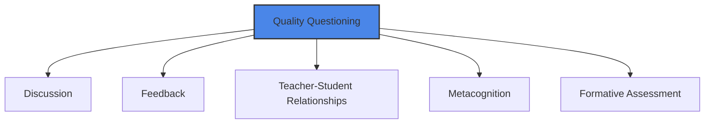

```mermaid
graph TD
    QQ[Quality Questioning] --> D[Discussion]
    QQ --> F[Feedback]
    QQ --> R[Teacher-Student Relationships]
    QQ --> M[Metacognition]
    QQ --> FA[Formative Assessment]
    
    style QQ fill:#4a86e8,stroke:#333,stroke-width:2px
```